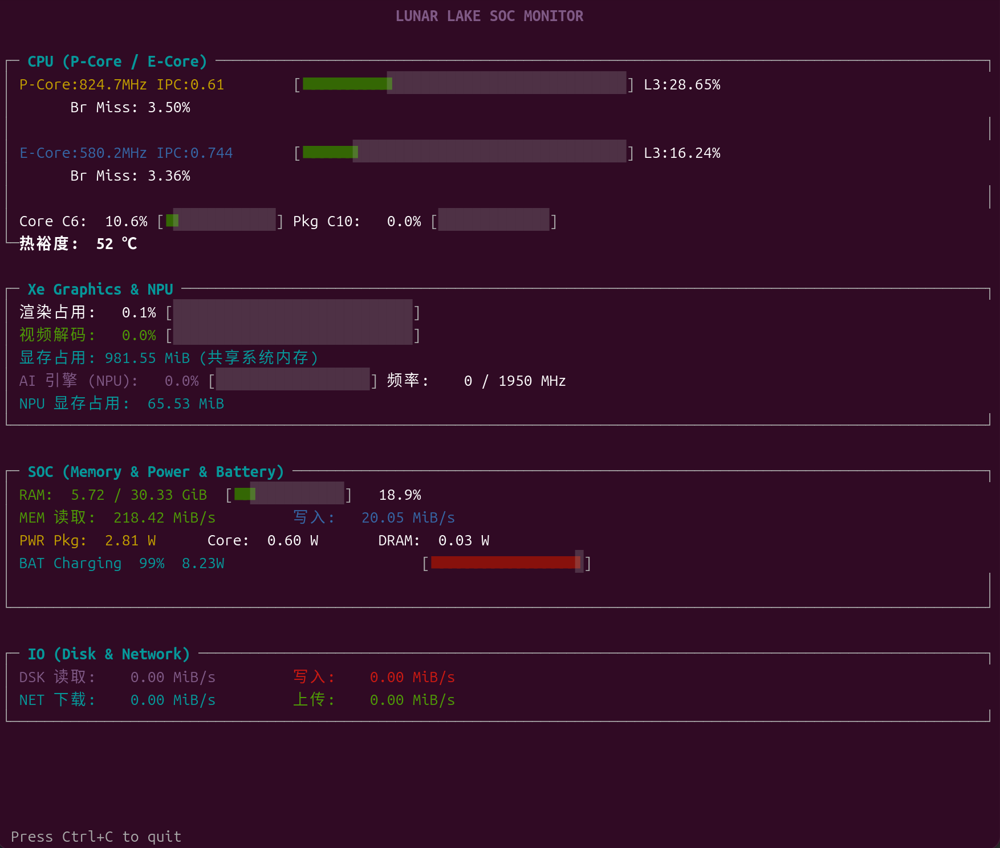

# xe_top

<div align="center">

**Intel Core Ultra 平台全栈性能监控工具**

实时监控 GPU · CPU · 内存(带宽+容量) · 功耗(RAPL) · 电池 · 磁盘 · 网络 · NPU

类似 `top` 的全屏终端 UI，数据源自 Linux PMU / sysfs，与 Ubuntu 系统监视器逻辑一致

[](LICENSE)
[](https://www.kernel.org/)
[](https://en.cppreference.com/wiki/c/help/idx/intro)
[](https://www.intel.com/)

</div>

---

## 功能特性

| 监控模块 | 数据来源 | 指标详情 |
|---------|---------|---------|
| **Xe GPU** | 内核 PMU 驱动 | 渲染引擎占用 (%), 视频引擎占用 (%), 实际频率 (MHz), 显存占用 (MiB) |
| **CPU** | 硬件性能计数器 | P-Core / E-Core 实际频率 (MHz), IPC, 缓存未命中率 (%), 分支预测未命中率 (%), C6/C10 深度睡眠占比 (%), 热裕度 (°C) |
| **内存带宽** | Uncore IMC 计数器 | 读/写带宽 (MiB/s, GB/s) |
| **内存容量** | `/proc/meminfo` | 总量 / 已用 / 可用 (GiB), 使用率 (%), 基于 MemAvailable（含可回收缓存，与系统监视器一致） |
| **RAPL 功耗** | 内核 MSR/sysfs | Package / Core / DRAM 功耗 (W) |
| **电池** | ACPI sysfs | 充放状态, 剩余电量 (%), 瞬时功率 (W) |
| **磁盘 IO** | `/sys/block` | 读/写速率 (MiB/s) |
| **网络 IO** | `/sys/class/net` | 下载/上传速率 (MiB/s) |
| **NPU (AI 引擎)** | sysfs 设备节点 | 利用率 (%), 实际/最大频率 (MHz), 显存占用 (MiB) |

## 系统要求

| 项目 | 要求 |
|------|------|
| **CPU** | Intel Core Ultra (200V / 200H / 200U 系列) |
| **操作系统** | Linux 内核 ≥ 6.8（推荐） |
| **权限** | 部分指标需 `root` 权限（RAPL 功耗、PMU 计数器） |
| **依赖** | `cmake`, `gcc`/`clang`, `make`, librt, libm（系统标准库） |

## 快速开始

### 编译

```bash
# 使用项目脚本（推荐）
chmod +x make.sh
./make.sh

# 或使用 CMake 手动编译
cmake -B build && cmake --build build
```

编译产物位于 `build/xe_top`。

### 运行

```bash
# 完整监控（推荐 sudo，部分功能需 root）
sudo ./build/xe_top

# 自定义刷新间隔（2 秒）
sudo ./build/xe_top -i 2

# 禁用特定模块
sudo ./build/xe_top --no-gpu --no-cpu --no-power

# 仅监控 CPU + GPU（无需 root）
./build/xe_top --no-power --no-battery --no-disk --no-net

# 查看帮助
./build/xe_top -h
```

### 快捷键

| 按键 | 功能 |
|------|------|
| `Ctrl+C` | 退出程序（通过信号处理 + 非阻塞 stdin 读丢弃） |

## 命令行选项

```
用法: ./xe_top [选项]

选项:
  -i, --interval <秒>  刷新间隔 (默认: 1，支持亚秒级，最小值 0.1)
  -G, --no-gpu         禁用 GPU 监控
  -C, --no-cpu         禁用 CPU 监控
  -P, --no-power       禁用功耗监控
  -M, --no-memory      禁用内存监控（带宽 + 容量）
  -B, --no-battery     禁用电池监控
  -D, --no-disk        禁用磁盘监控
  -N, --no-net         禁用网络监控
  -A, --no-npu         禁用 NPU 监控
  -h, --help           显示此帮助信息
```

## 项目结构

```
├── CMakeLists.txt              # CMake 构建配置 (C11, -Wall -Werror)
├── make.sh                     # 快速编译脚本（自动检测依赖、颜色输出）
├── README.md                   # 项目文档
├── src/
│   ├── main.c                  # 程序入口与主循环（信号处理 + 非阻塞 stdin）
│   ├── config/
│   │   ├── config.h            # 运行时配置结构体（各模块启用开关、间隔）
│   │   └── config.c            # getopt_long 命令行参数解析（支持亚秒级间隔）
│   ├── monitor/
│   │   ├── gpu_monitor.c/h     # Xe GPU PMU 监控（动态查找 xe_ PMU 设备）
│   │   ├── cpu_monitor.c/h     # CPU PMU 监控 (P-Core / E-Core 分别计数)
│   │   ├── mem_monitor.c/h     # 内存带宽 (IMC 计数器) + 容量 (/proc/meminfo)
│   │   ├── power_monitor.c/h   # RAPL 功耗监控 (Package / Core / DRAM)
│   │   ├── battery_monitor.c/h # 电池监控 (动态扫描 ACPI sysfs 电池设备)
│   │   ├── disk_monitor.c/h    # 磁盘 IO 监控 (自动跳过 loop/zram)
│   │   ├── net_monitor.c/h     # 网络 IO 监控 (自动选择首个 up 网卡，跳 lo)
│   │   └── npu_monitor.c/h     # NPU AI 引擎监控 (/sys/class/accel/accel0)
│   ├── display/
│   │   ├── display.h           # 终端 UI 声明
│   │   └── display.c           # ANSI 全屏渲染引擎（备用屏幕缓冲区）
│   └── util/
│       ├── perf_util.h         # PMU 工具函数声明
│       └── perf_util.c         # perf_event_open 封装 / sysfs 解析
└── build/                      # 编译输出目录
    └── xe_top                  # 可执行文件
```

## UI 布局



## 技术实现

### 数据采集

| 模块 | 技术路径 | 详细说明 |
|------|---------|---------|
| **GPU** | `perf_event_open` → Xe PMU | 动态扫描 `/sys/bus/event_source/devices/` 查找 `xe_` 前缀 PMU 设备；从 sysfs 动态解析 `event` / `engine_class` / `engine_instance` / `gt` 字段的位偏移；分别打开渲染引擎和视频解码引擎的 active-ticks / total-ticks 计数器；通过轮询 `/proc/*/fdinfo` 按 drm-client-id 去重累加 GTT 显存占用（每 3 个采样周期扫描一次以降低开销） |
| **CPU** | `perf_event_open` → 架构 PMU | 分别绑定 P-Core (`cpu_core`) 和 E-Core (`cpu_atom`) 的 `instructions`, `cycles`, `ref-cycles` 等架构事件；通过 MSR 类型 PMU 读取 `aperf`/`mperf` 计算实际频率；通过 `cstate_core`/`cstate_pkg` PMU 读取 C6/C10 驻留计数；通过 MSR 热裕度事件获取降频前温度余量 |
| **内存带宽** | `perf_event_open` → Uncore IMC | 打开 `uncore_imc_free_running_0/1` 的 `data_read`/`data_write` 事件（解析 `event=,umask=` 双字段组合 config）；自动读取 sysfs 中的 `.scale` 缩放因子；累计两个 IMC 通道的增量计算带宽 |
| **内存容量** | 读取 `/proc/meminfo` | 解析 `MemTotal` / `MemAvailable`，真实已用 = Total - Available（包含可回收缓存，与系统监视器一致），单位 kB → MiB → GiB |
| **功耗** | 读取 RAPL sysfs | 从 `/sys/class/powercap/intel-rapl:0` 读取 Package / Core / DRAM 三路能量计数器 (µJ)；差分计算功率 (W)，防御无符号减法下溢 |
| **电池** | 读取 ACPI sysfs | 动态扫描 `/sys/class/power_supply/` 查找 `type=Battery` 的设备；从 `current_now` (µA) × `voltage_now` (µV) 计算瞬时功率 (W)；统一取绝对值，充放方向由 `status` 判断 |
| **磁盘** | 读取 `/sys/block/*/stat` | 自动跳过 `loop` 和 `zram` 虚拟设备，选择首个真实块设备；解析 stat 文件第 3/7 字段（读写扇区数）；Linux 内核固定以 512 字节/扇区计算，差分得到速率 |
| **网络** | 读取 `/sys/class/net/*/statistics` | 自动跳过 `lo` 回环接口，选择首个 `operstate=up` 的物理网卡；解析 `rx_bytes` / `tx_bytes`，差分计算上下行速率 |
| **NPU** | 读取 sysfs 设备节点 | 从 `/sys/class/accel/accel0/device/` 读取 `npu_busy_time_us`（累计忙碌微秒）、`npu_current_frequency_mhz`、`npu_max_frequency_mhz`、`npu_memory_utilization`；利用率 = (忙碌时间差 / 流逝时间) × 100% |

### 显示引擎

- 使用 **ANSI 转义序列** 实现全屏覆盖式 UI（无闪烁、无清屏）
- **备用屏幕缓冲区**：进入时 `\033[?1049h` 保存终端内容，退出时 `\033[?1049l` 恢复原画面
- **非阻塞键盘输入**：`tcsetattr` 关闭回显 (ECHO) 和规范模式 (ICANON)，设置 `VMIN=0, VTIME=0` 使 `read()` 立即返回；主循环中每次迭代读取并丢弃 stdin 缓冲区，防止输入堆积
- **信号处理**：捕获 `SIGINT` / `SIGTERM` / `SIGHUP`，设置 `running=0` 优雅退出并恢复终端
- **自适应终端尺寸**：每次渲染通过 `ioctl TIOCGWINSZ` 实时获取终端宽高；检测尺寸变化时自动清屏消除残影
- **btop 风格动态进度条**：`\033[K` 清除行尾，填充字符为 `■`（已占）和 `░`（未占）；随百分比自动变色：≤50% 绿色 → 80% 黄色 → >80% 红色
- **UTF-8 框线字符**（`┌─┐│└─┘`）绘制面板，支持禁用模块时显示 `(disabled)` 占位

## 构建自定义

### CMake 选项

```bash
# 指定编译器
CC=clang cmake -B build -DCMAKE_BUILD_TYPE=Release

# Debug 模式
cmake -B build -DCMAKE_BUILD_TYPE=Debug

# 指定架构优化
cmake -B build -DCMAKE_C_FLAGS="-O2 -march=native"
```

### 编译脚本变量

```bash
# 指定编译器
CC=clang ./make.sh

# 传递 CMake 选项
CMAKE_OPTS="-DCMAKE_C_FLAGS=-O2" ./make.sh
```

## 已知问题

### NPU 频率读取失败
NPU 实际频率和最大频率显示为 0 或异常值。这是 Intel NPU 驱动的问题，当驱动更新后应该能解决。

### 视频引擎占用率无法读取
Xe GPU 的视频解码引擎占用率目前无法读取，正在修复中。

### 更多功能待添加
- 支持 Core Ultra 系列的其他型号（如 200H、200U）
- 更多硬件监控指标
- 历史数据记录和导出

---

## 故障排除

### 权限不足

```bash
# 使用 sudo 运行
sudo ./build/xe_top

# 或将用户加入 perfmon 组（部分系统）
sudo usermod -a -G perfmon $USER
```

### 部分指标显示为 0 或 disabled

```bash
# 检查 PMU 是否可用
sudo dmesg | grep -i perf

# 检查内核模块
lsmod | grep -E "i915|xe|intel_rapl"
lsmod | grep -E "accel"  # NPU 驱动

# 确认 PMU 设备是否存在
ls /sys/bus/event_source/devices/
```

### 内存带宽显示为 0

```bash
# 确认 Uncore IMC PMU 存在
ls /sys/bus/event_source/devices/ | grep uncore_imc

# 检查 IMC 事件文件
cat /sys/bus/event_source/devices/uncore_imc_free_running_0/events/data_read
```

### 内存容量显示 "(RAM disabled)"

```bash
# 确认 /proc/meminfo 可读
cat /proc/meminfo | head -5
```

### NPU 不可用

```bash
# 检查 NPU 设备节点
ls /sys/class/accel/

# 确认 NPU 驱动加载
ls /sys/class/accel/accel0/device/
```

### 终端显示异常

```bash
# 确保终端支持 ANSI 256 色
export TERM=xterm-256color

# 重置终端（若程序异常退出导致终端状态混乱）
reset
```

### 程序异常退出导致终端状态混乱

如果程序未经清理退出（如 `kill -9`），可能遗留以下问题：
- **回显关闭**：输入字符不显示 → 运行 `stty echo` 恢复
- **光标隐藏**：光标消失 → 运行 `printf '\033[?25h'` 显示光标
- **备用屏幕残留** → 运行 `printf '\033[?1049l'` 退出备用屏幕

直接运行 `reset` 可一键恢复所有终端属性。

## 许可证

本项目基于 [GPL-2.0](LICENSE) 许可证发布。

## 贡献

欢迎提交 Issue 和 Pull Request！

---

<div align="center">

**Made with ❤️ for Linux performance enthusiasts**

</div>